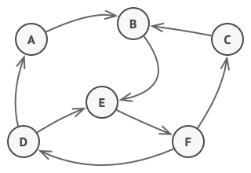
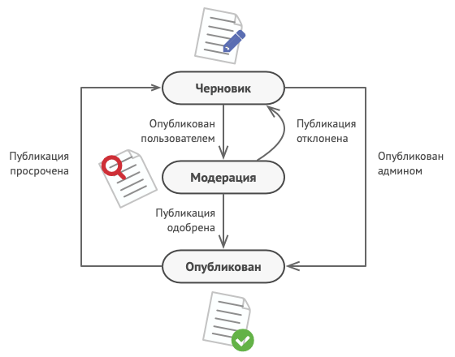
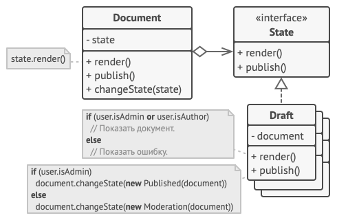
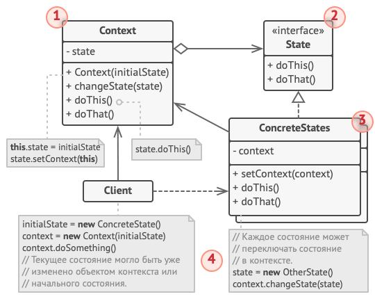
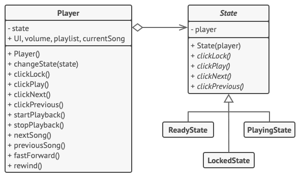

# Состояние (State)

## Суть паттерна

**Состояние** — это поведенческий паттерн проектирования, который позволяет объектам менять поведение в зависимости от своего состояния. Извне создаётся впечатление, что изменился класс объекта.

## Проблема

Паттерн основывается на концепции **конечного автомата (машины состояний)**: программа может находиться в одном из нескольких предопределённых состояний и реагировать по-разному на одни и те же события.

  

Пример: объект `Документ` может находиться в состояниях `Черновик`, `Модерация` или `Опубликован`. Вызов метода `опубликовать` зависит от текущего статуса:
* **Черновик** → отправляет документ на модерацию.
* **Модерация** → публикует документ (при наличии прав администратора).
* **Опубликован** → ничего не делает.

  

Обычно такую логику реализуют через условные операторы (`if` или `switch`). При увеличении числа состояний каждый метод превращается в раздутую конструкцию, которую крайне трудно поддерживать и модифицировать.

## Решение

Паттерн предлагает вынести поведение каждого состояния в отдельный класс. Первоначальный объект (**Контекст**) хранит ссылку на текущий объект-состояние и делегирует ему выполнение работы.

  

Все состояния реализуют общий интерфейс, поэтому Контекст работает с ними единообразно и может менять состояние на лету. В отличие от *Стратегии*, состояния и контекст могут знать друг о друге и самостоятельно инициировать переходы.

## Аналогия из жизни

Кнопки смартфона меняют своё поведение в зависимости от его состояния:
* **Разблокирован:** нажатие кнопок вызывают действия в интерфейсе.
* **Заблокирован:** нажатие открывает экран разблокировки.
* **Разряжен:** нажатие показывает экран зарядки.

## Структура

  

1. **Контекст:** хранит ссылку на текущий объект состояния и делегирует ему работу. Содержит метод для смены состояния.
2. **Состояние:** интерфейс, описывающий методы, общие для всех конкретных состояний.
3. **Конкретные состояния:** реализуют поведение, специфичное для конкретного состояния контекста.
4. **Обратная связь:** состояние может хранить ссылку на Контекст для получения данных и переключения его состояния.
5. **Управление переходами:** и Контекст, и объекты состояний могут определять момент переключения на следующее состояние.

### Архитектурный пример (Аудиопроигрыватель)

  

Объект проигрывателя (Контекст) передаёт обработку нажатий кнопок (`Play`, `Lock`, `Next`, `Prev`) текущему объекту-состоянию (`LockedState`, `ReadyState`, `PlayingState`). Состояния сами определяют реакцию на действия и при необходимости меняют состояние проигрывателя.

## Применимость

* Когда поведение объекта кардинально зависит от его внутреннего состояния, типов состояний много, и они часто меняются.
* Когда код класса содержит громоздкие условные операторы, выбирающие поведение на основе значений полей.
* Когда требуется устранить дублирование кода в похожих состояниях за счёт иерархии классов.

## Преимущества и недостатки

**Преимущества:**
* Избавляет от больших условных операторов машины состояний.
* Изолирует логику конкретных состояний в отдельных классах (Принцип единственной ответственности).
* Упрощает код контекста и позволяет добавлять новые состояния без изменения существующего кода (Принцип открытости/закрытости).

**Недостатки:**
* Может неоправданно усложнить код, если состояний мало и они редко меняются.

## Отношения с другими паттернами

* **Мост, Стратегия, Состояние и Адаптер** имеют похожую структуру на основе композиции и делегирования, но решают разные задачи.
* **Состояние и Стратегия:** оба паттерна меняют поведение объекта через вложенные объекты. В *Стратегии* эти объекты не знают друг о друге, а в *Состоянии* конкретные состояния могут сами переключать контекст.
